# Checkout Inteligênte

## Telas para todos:

### Tela Inicial (usuário não logado):

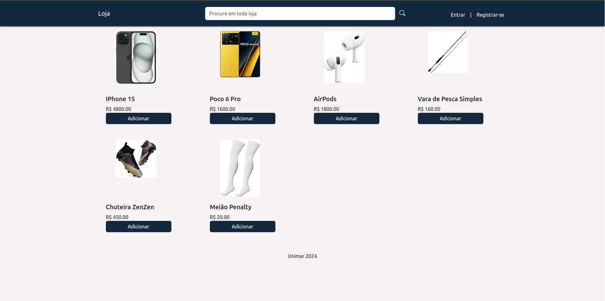

### Tela Inicial (usuário logado):

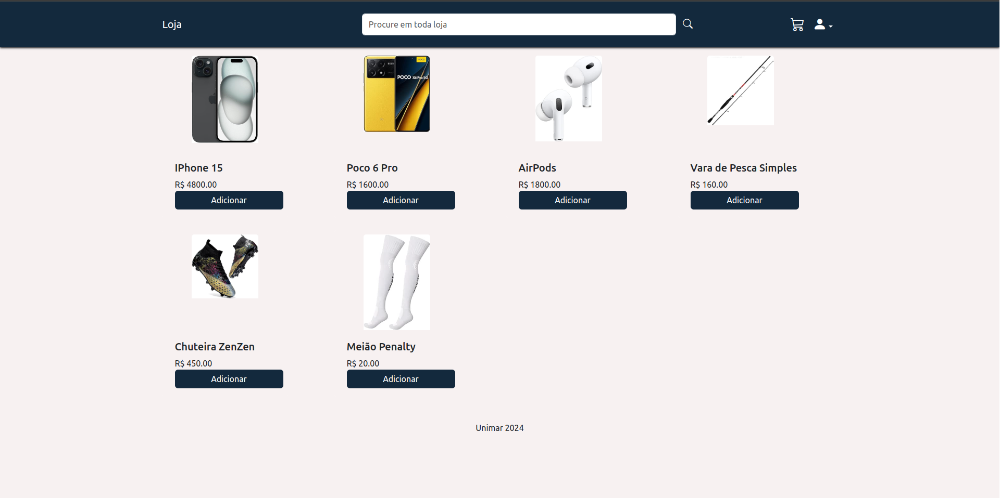

### Menu Cliente:

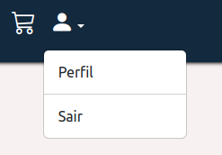

### Tela de Registro:

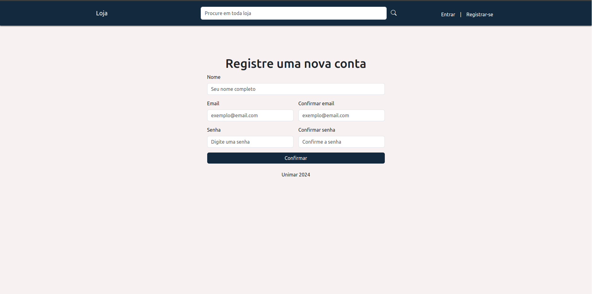

### Tela de Login:

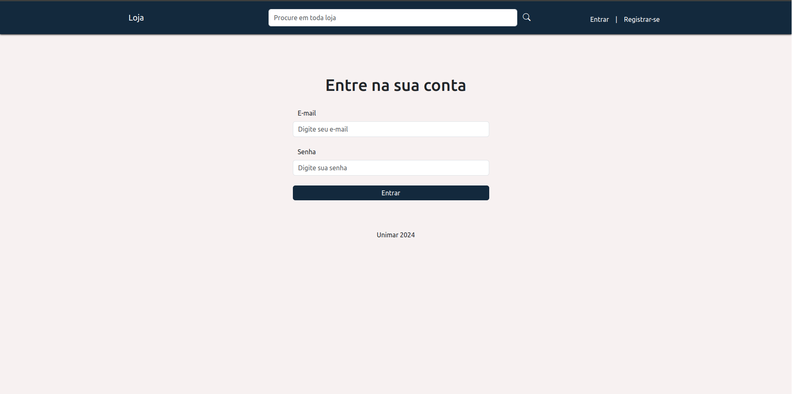

### Carrinho:

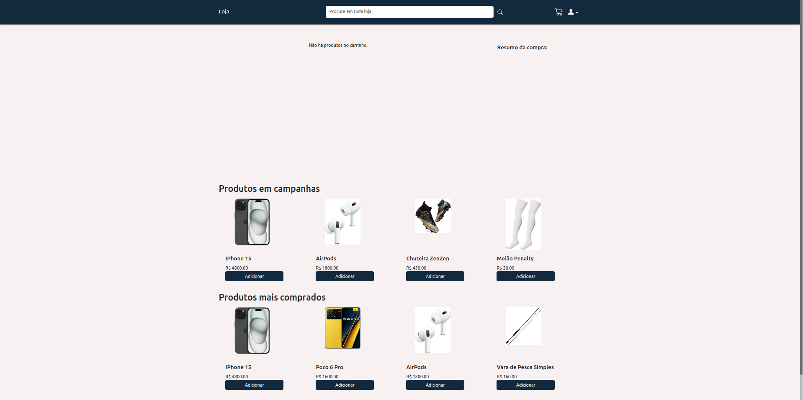

### Checkout:

**Apenas se o carrinho não estiver vazio**

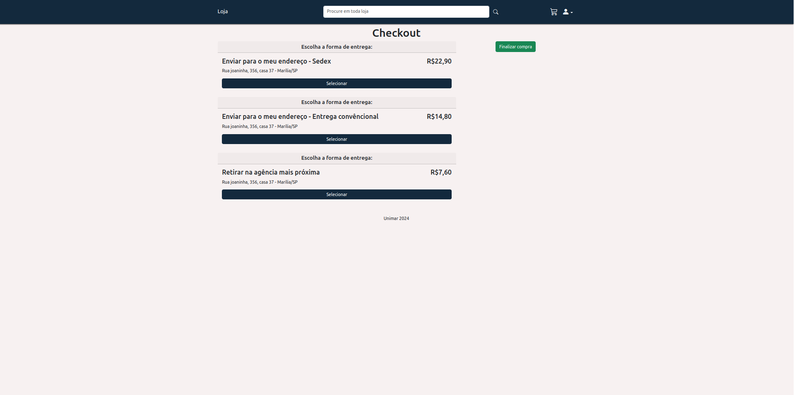

## Telas Administrativas:

### Menu Administrador:

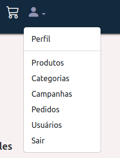

### Produto:

#### Tela de Produtos:

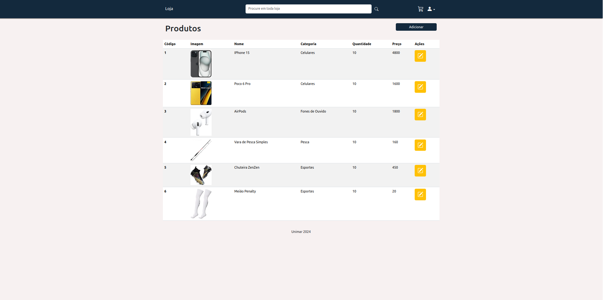

#### Tela para adicionar um produto:

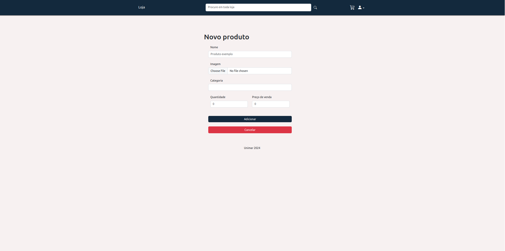

#### Tela para editar ou remover um produto:

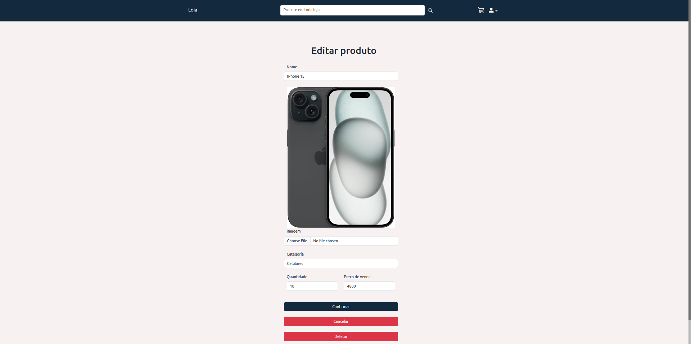

### Categoria:

#### Tela de Categorias:

#### Tela para adicionar uma categoria:

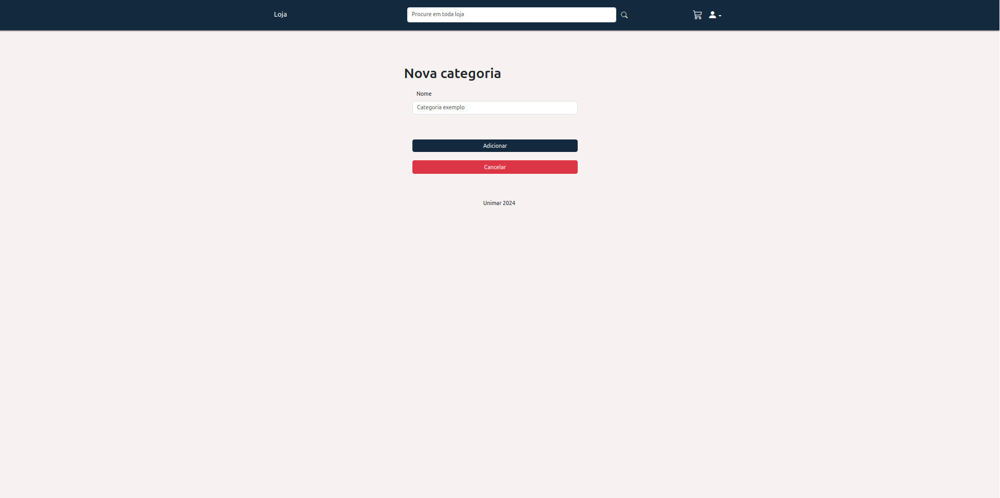

#### Tela para editar ou remover uma categoria:

### Campanhas:

#### Tela de campanhas:

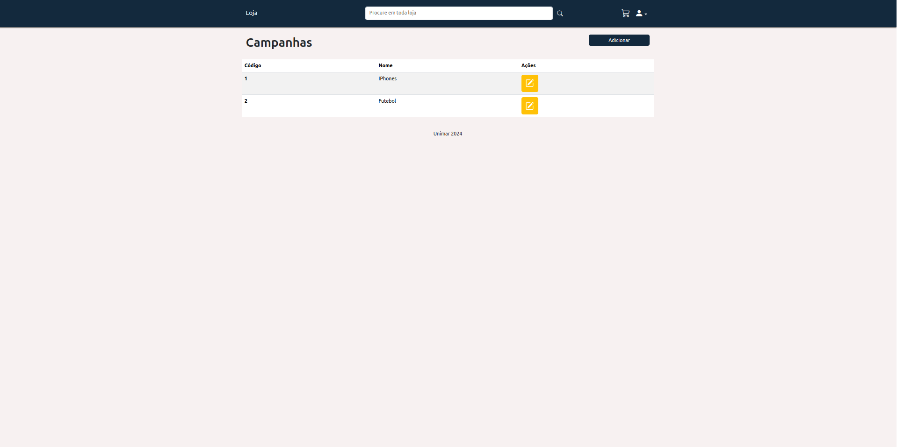

#### Tela para adicionar uma campanha:

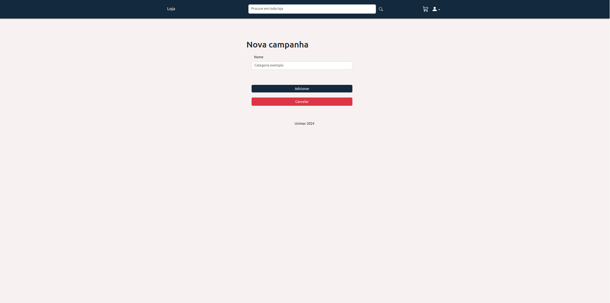

#### Tela para editar ou remover uma campanha:

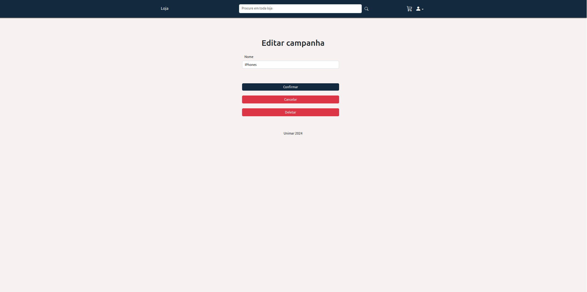

### Usuários:

**Admistradores em azul**

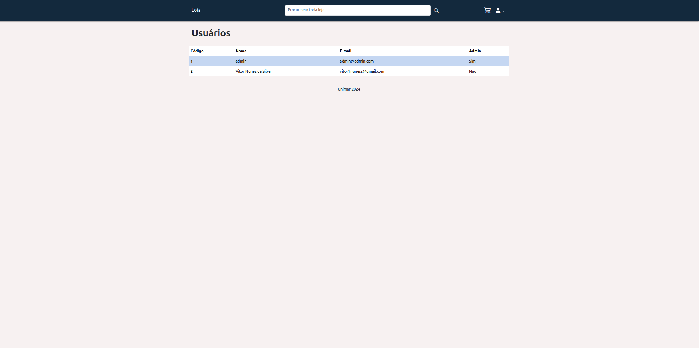

### Pedidos:

**Apenas pedidos finalizados**

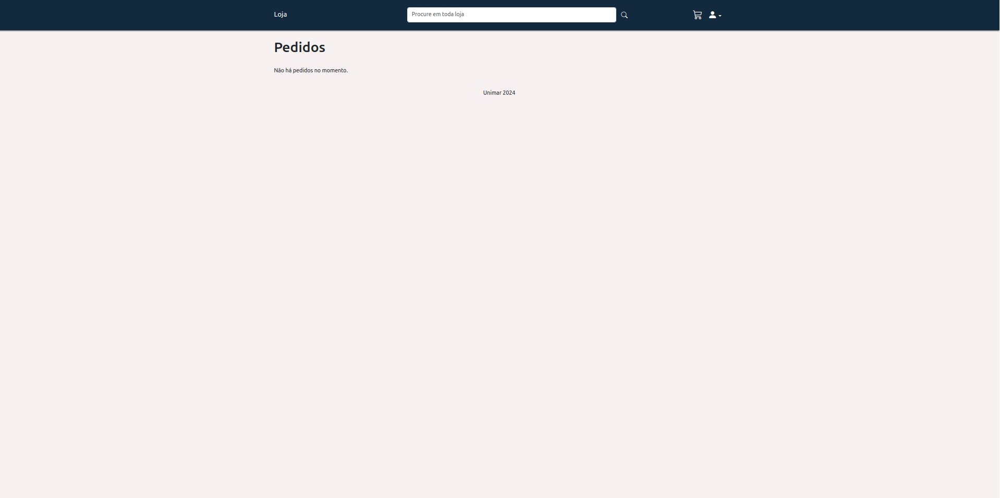
