# Checkout Inteligente (Aplicação Front-end)

Esta aplicação é destinada a simular um e-commerce, fazendo o consumo de uma API.

-   **[Instalação](#instalação)**
-   **[Aplicação](#aplicação)**
-   **[Colaboradores](#colaboradores)**

## Instalação

### Pré-requisitos

Antes de começar, você precisa ter os seguintes itens instalados em sua máquina:

1. **[Node.js](https://nodejs.org/)**
2. **[Git](https://git-scm.com/downloads)**
3. **[API (Back-end)](https://github.com/VitorNuness/checkout-inteligente-back)**

### Clonando o Repositório

```bash
git clone https://github.com/VitorNuness/checkout-inteligente-front.git

cd checkout-inteligente-front
```

### Instalando Dependências

Execute o seguinte comando para instalar as dependências do projeto:

```bash
npm install
```

### Executando a Aplicação

Para executar a aplicação, use o seguinte comando:

```bash
npm run dev
```

O servidor deve iniciar e você verá uma mensagem indicando que a aplicação está rodando em http://localhost:5173.

---

## Aplicação

### Página principal

A página principal demonstra para os usuários, campanhas, produtos mais vendidos, campanhas e os demais produtos. Podendo ser acessada por usuários autenticados e não autenticados.


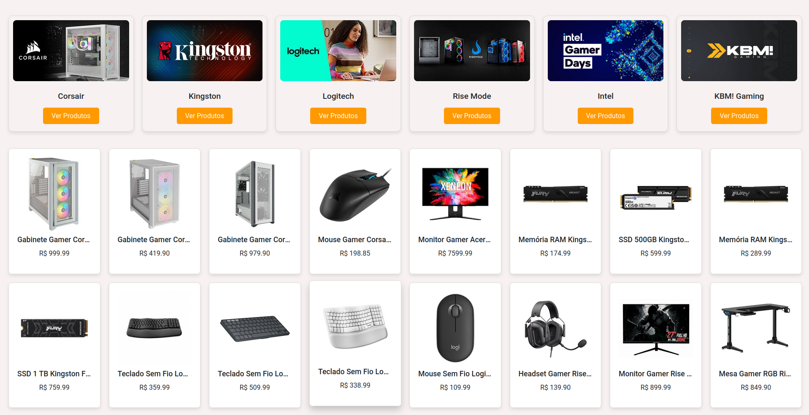
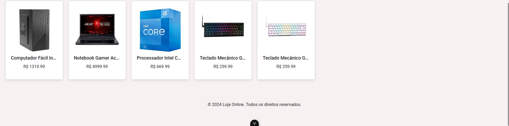

Quando o usuário é autenticado, os produtos apresentam a opção de compra e o cabeçalho mostra o carrinho e menu do usuário.


---

### Autenticação

Para a autenticação o usuário poderá fazer o login ou, caso não tenha uma conta, fazer seu cadastro.

**Entrar:**

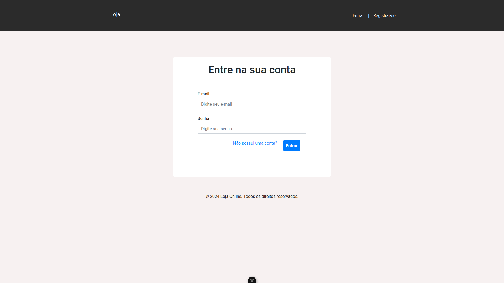

**Registro:**

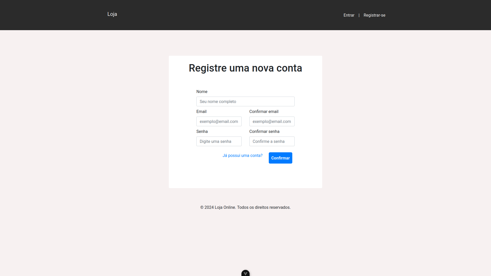

---

### Carrinho

O carrinho apresenta os produtos que o cliente selecionou para compra, podendo ser finalizado, somente se, houver algum produto adicionado.

O carrinho além de mostrar os produtos que o usuário quer comprar, também traz sugestões de produtos, podendo assim, aumentar o ticket médio. A primeira sugestão é baseada nos produtos em campanha. Já a segunda, é baseado nos produtos mais vendidos, por categoria dos produtos, que estão no carrinho.

**Carrinho vazio:**


**Carrinho com produtos:**

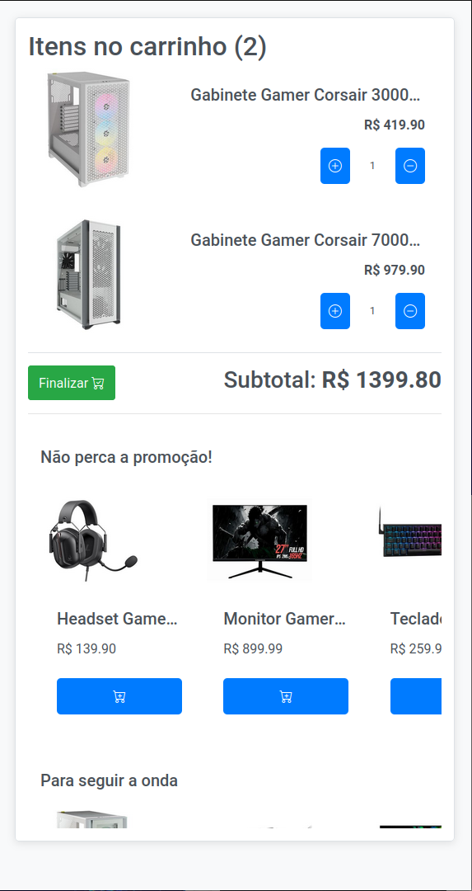

**Carrinho finalizado:**


---

### Menu do usuário

O menu que os usuários podem sair de sua conta. Também, é onde os administradores podem acessar o gerenciamento de, campanhas, categorias e produtos.

**Menu cliente:**

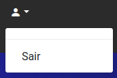

**Menu administrador:**


---

### Importante!

As próximas sessões são específicas para **administradores**.

### Produtos

Esta página, lista todos os produtos cadastrados no sistema. Também, é possível adicionar novos produtos, por meio do botão "Adicionar", editar ou deletar o produto, pelo botão no final de cada linha da tabela, na coluna "Ações".

**Lista de produtos:**

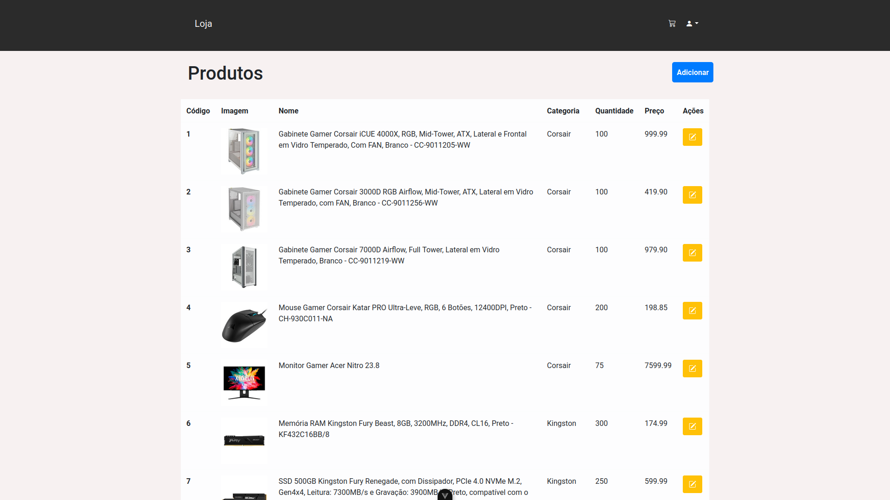

**Adicionar um produto:**

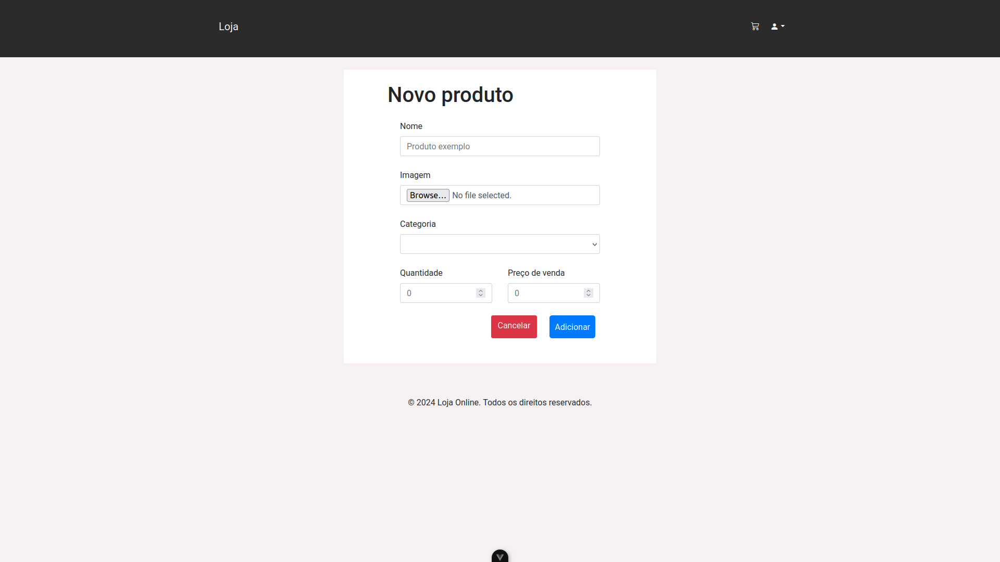

**Editar ou deletar um produto:**

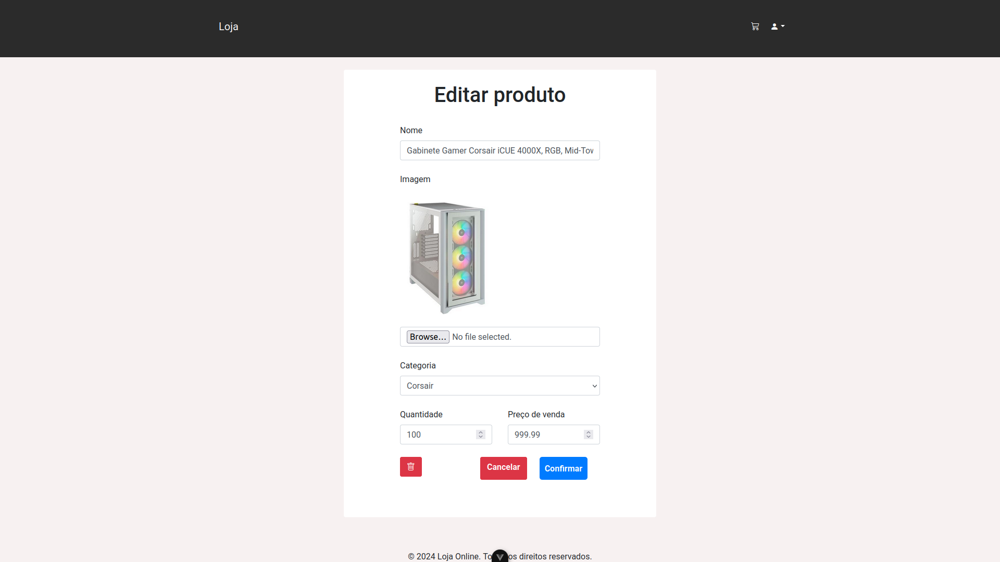

---

### Categorias

Esta página, lista todas as categorias cadastradas no sistema. Também, é possível adicionar novas categorias, por meio do botão "Adicionar", editar ou deletar a categoria, pelo botão no final de cada linha da tabela, na coluna "Ações".

**Lista de categorias:**

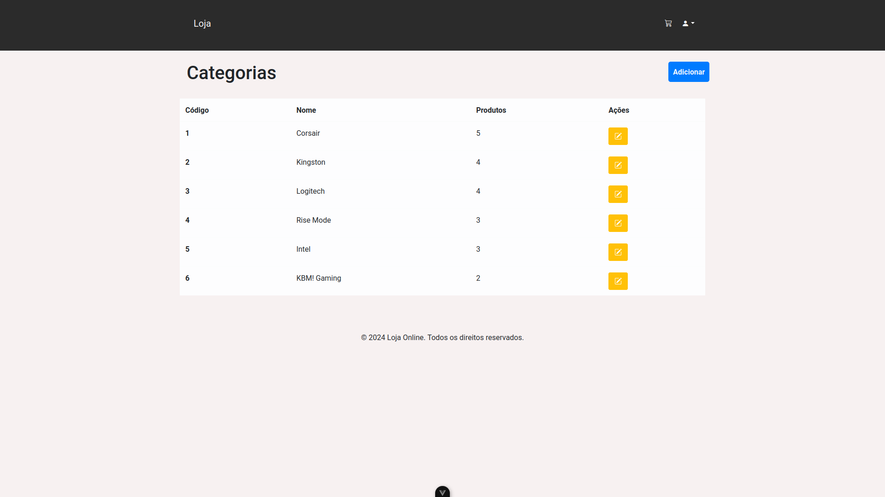

**Adicionar uma categoria:**

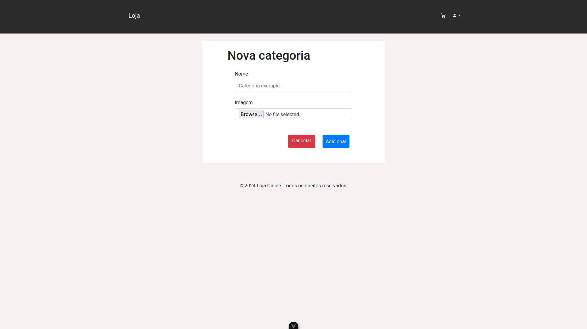

**Editar ou deletar uma categoria:**

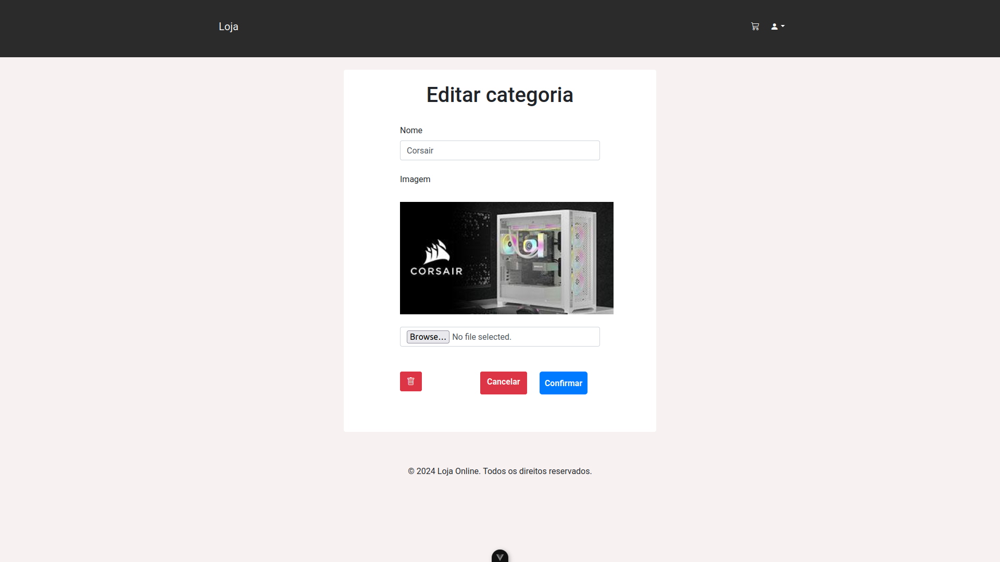

---

### Campanhas

Esta página, lista todas as campanhas cadastradas no sistema. Também, é possível adicionar novas campanhas, por meio do botão "Adicionar", editar ou deletar a campanha, pelo botão no final de cada linha da tabela, na coluna "Ações".

Nas telas de adicionar e editar, podem ser selecionados os produtos que fazem parte da campanha.

**Lista de campanhas:**

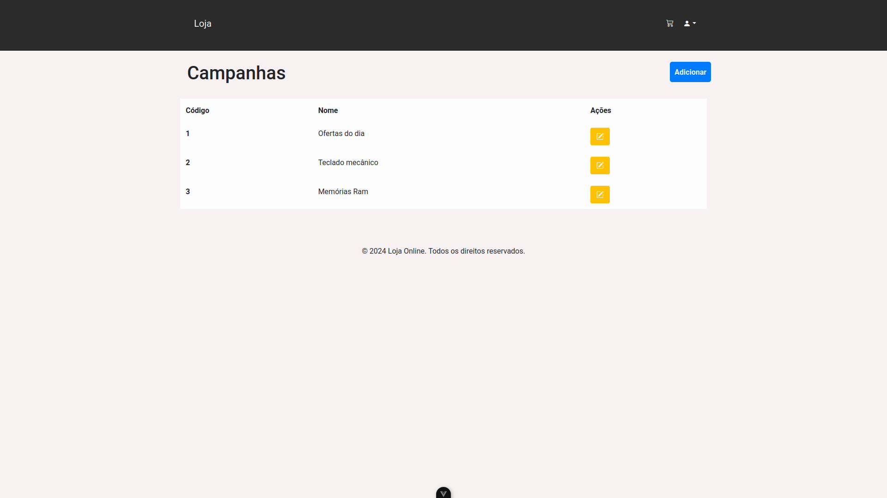

**Adicionar uma campanha:**

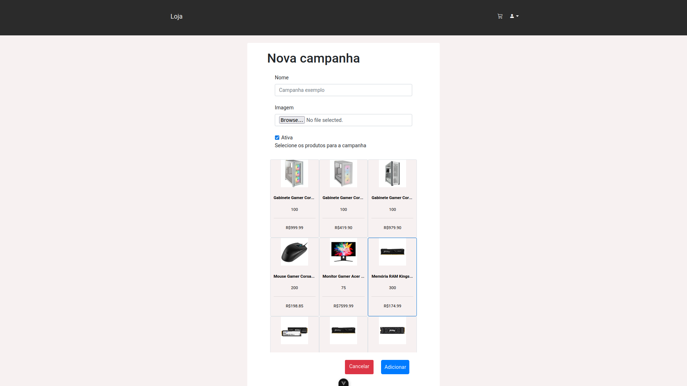

**Editar ou deletar uma campanha:**

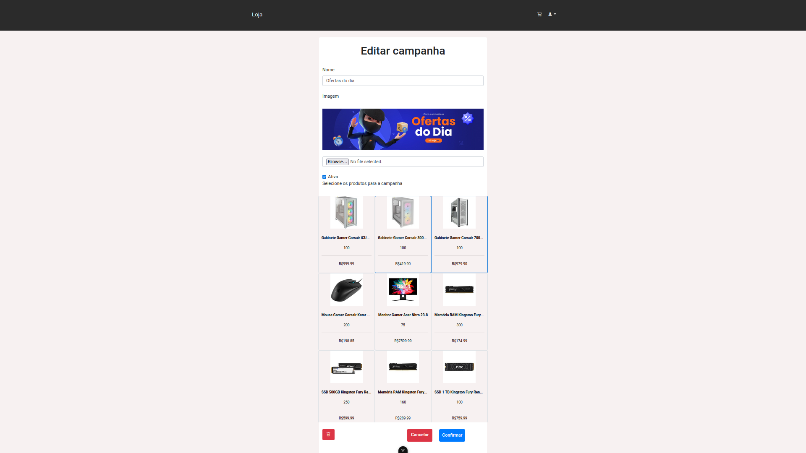

---

## Colaboradores

**@[AlexHPasquini](https://github.com/AlexHPasquini) | @[MayconMacedo23](https://github.com/MayconMacedo23) | @[vinirainho](https://github.com/vinirainho) | @[VitorNuness](https://github.com/VitorNuness)**
